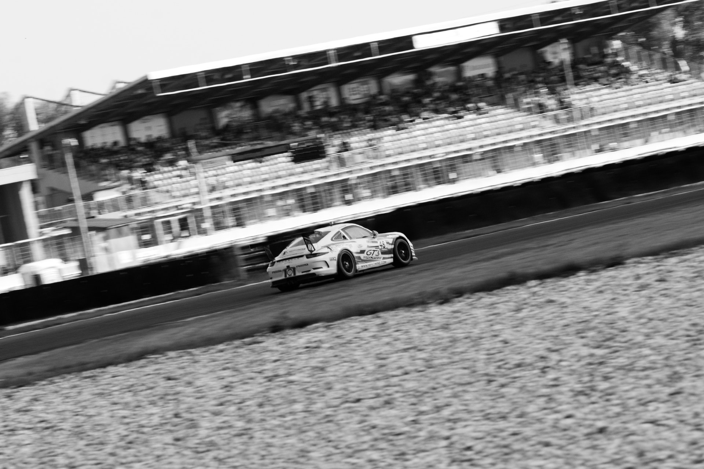

####A short description of my time at the Porsche AG in the field of marketing communication motorsports.

My studies at the Arnhem Business School integrated a full year abroad, one semester studying abroad and one semester doing an internship abroad. I decided to do a six-month internship at the Porsche AG where I was able to gain practical experiences as I contributed to several campaigns as well as handled my own projects.

I organized a roadshow through several cities in cooperation with another intern with the purpose of raising awareness for the [12h race at the Nürburgring](https://www.nuerburgring.de/events-tickets/automobil/adac-total-24h-rennen.html). I was also invited to attend the race, for which I organised a small exhibition of classic race cars. Furthermore, I established an extensive competitor analysis in the field of motorsports, which my supervisors used as a basis for introducing new approaches as well as for planning the upcoming marketing activities.
